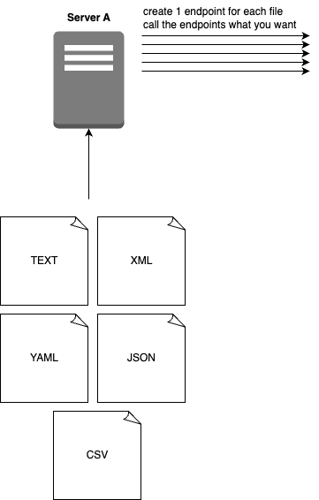

# 00 Data parsing server - Part II

**Type**: Individual

This is a continuation of the assignment: Data Parsing.

In the previous assignment you created scripts that can parse files. In this assignment you should expose the data from a server.

Create a single server. Using one of the langauges from the data parsing assignment would make sense. 
Remember, at this level it is your job to make decision such as language, libraries and frameworks. 

Create endpoints for each data parsing task that serves the data. 

There should be an endpoint for each: XML, CSV YAML, TXT and JSON. 

# Python
https://github.com/Marcus-K-Thorsen/01a._Data_parsing_servers_part_1/blob/main/py-server-app/README.md

# JavaScript
https://github.com/Marcus-K-Thorsen/01a._Data_parsing_servers_part_1/blob/main/js-server-app/README.md